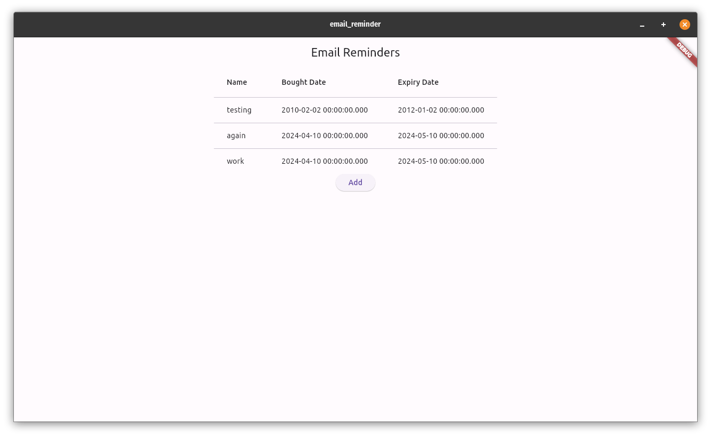
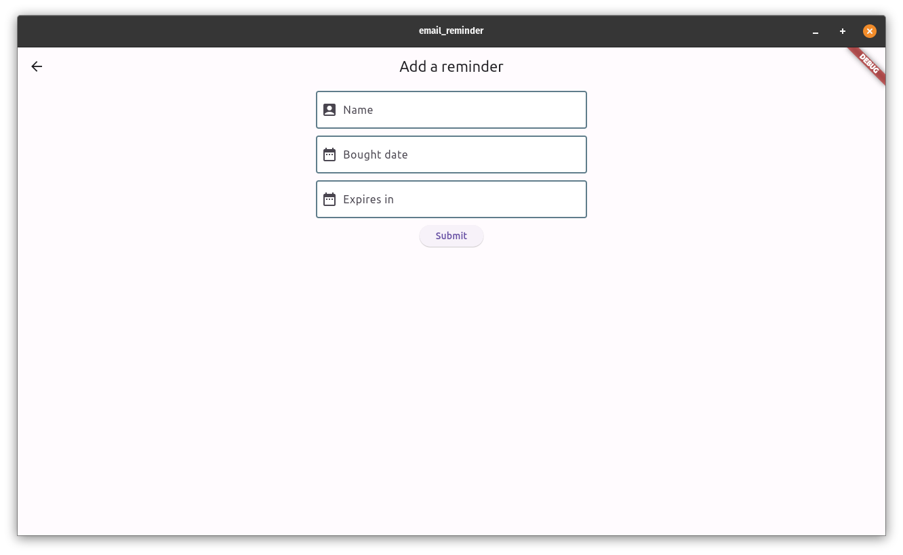
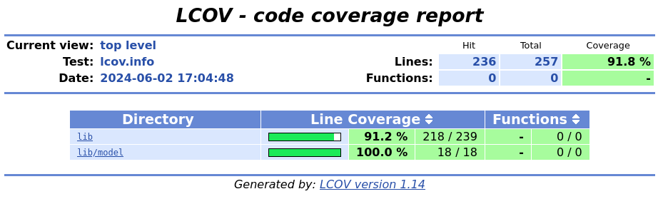

A project to send email reminders based on when something was bought and when it expires. It consists of a Flutter desktop application, an AWS Step Function and an AWS Lambda Python function.

The application consists of a home page displaying previously entered items and an input form page where reminders can be created. Whenever a reminder is created, an AWS Step Function is launched. It waits for the expiry time and triggers an AWS Lamda that will send an email reminder. Reminders are sent 1 week before expiry and on the expiry date. Should the expiry date fall within one week of the purchase time, only one email at expiry time will be sent.

 

Testing

Postman requests are included to test the Step Function API.

To run the flutter application tests with coverage, run the following command in the email_reminder folder: flutter test --coverage
The current test coverage is 91.8%. You can visualise it by running: genhtml coverage/lcov.info -o coverage/html. 
You may have to install lcov.
This will create a coverage folder in the email_reminder folder. Open the html folder inside this one. You can open the index.html file in a browser to view the coverage of the different classes.

Technically

The Isar database is used to store the items locally in the Flutter application.

How to reproduce this project

You will need an AWS account in order to create the Lambda, Step Function and API Gateway. 
Verify sender and recipient emails.
Api key

Further improvements
Make it possible to set sender and recipient emails.

Useful resources

API key for API Gateway
https://docs.aws.amazon.com/apigateway/latest/developerguide/api-gateway-setup-api-key-with-console.html
https://stackoverflow.com/questions/39061041/using-an-api-key-in-amazon-api-gateway

Step Function API
https://docs.aws.amazon.com/step-functions/latest/dg/tutorial-api-gateway.html

Isar Database
https://isar.dev/tutorials/quickstart.html

Flutter Desktop Codelab
https://codelabs.developers.google.com/codelabs/flutter-codelab-first#0